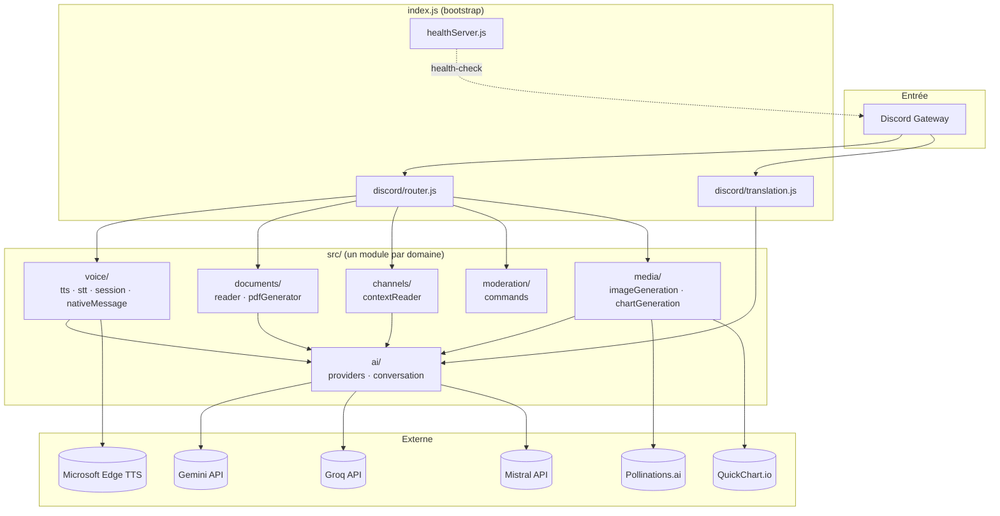
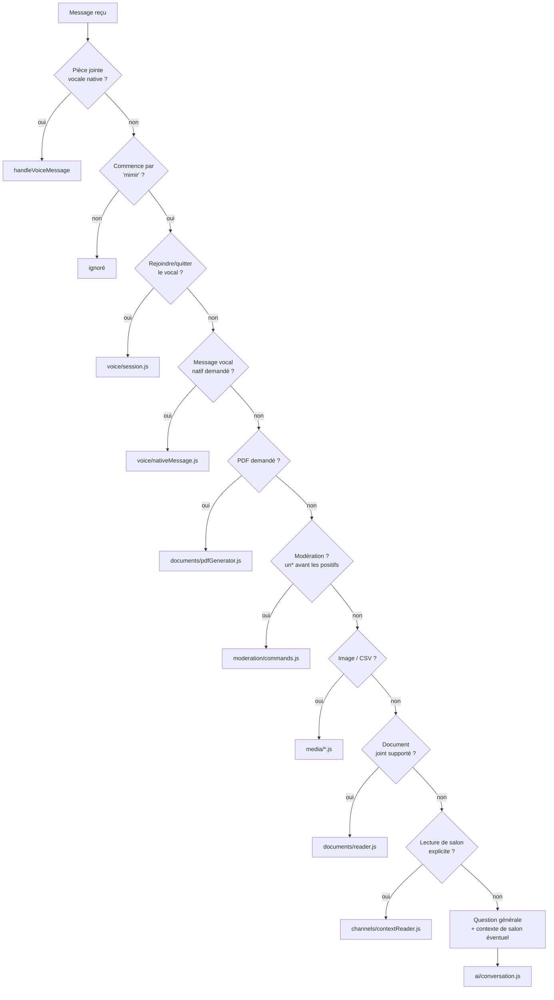
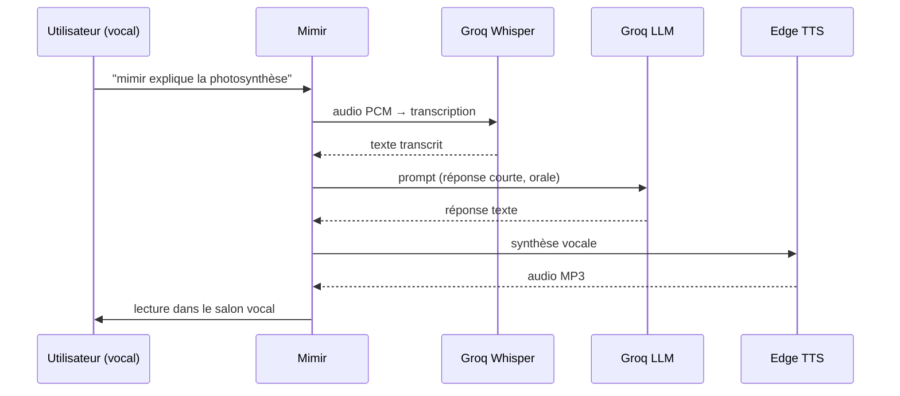
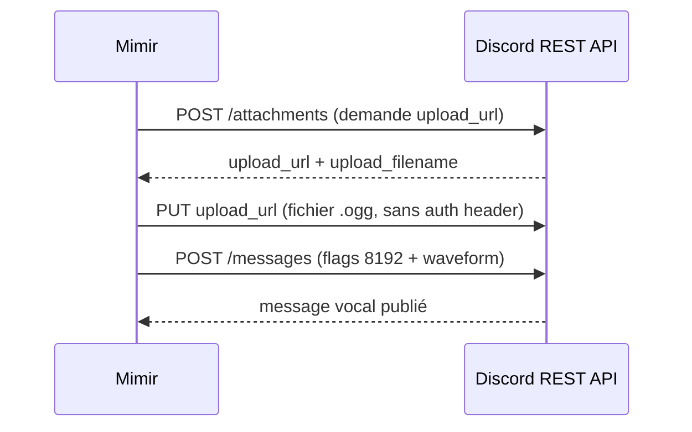
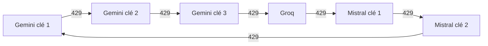

# 🔮 Mimir — Bot Discord IA multi-provider

Bot Discord qui répond dès qu'un message commence par **"mimir"**, propulsé
par une rotation automatique entre trois providers IA gratuits (Gemini,
Groq, Mistral). Voix temps réel, messages vocaux natifs, lecture de
documents, génération de PDF/images/graphiques, modération, traduction.

```
mimir explique-moi la différence entre une PCR et une qPCR
```

Chaque décision d'architecture non triviale est documentée et justifiée
dans **[docs/adr/](docs/adr/)** (Architecture Decision Records) — ce
README donne la vue d'ensemble, les ADR donnent le *pourquoi*.

---

## Sommaire

1. [Architecture](#architecture)
2. [Démarrage rapide](#démarrage-rapide)
3. [Fonctionnalités](#fonctionnalités)
4. [Routage des messages](#routage-des-messages)
5. [Vocal — deux mécanismes distincts](#vocal--deux-mécanismes-distincts)
6. [Documents : lecture et génération de PDF](#documents--lecture-et-génération-de-pdf)
7. [Lecture intelligente des salons](#lecture-intelligente-des-salons)
8. [Rotation multi-provider IA](#rotation-multi-provider-ia)
9. [Modération](#modération)
10. [Déploiement](#déploiement)
11. [Sécurité](#sécurité)
12. [Limites](#limites)

---

## Architecture



Voir [ADR 0001](docs/adr/0001-architecture-modulaire.md) pour la
justification de ce découpage.

```
mimir-bot/
├── index.js                    bootstrap : config, client Discord, healthcheck
├── src/
│   ├── config.js                 env vars + validation
│   ├── triggers.js                mots déclencheurs + correspondance
│   ├── ai/
│   │   ├── providers.js            rotation Gemini/Groq/Mistral
│   │   └── conversation.js         mémoire courte + appel IA principal
│   ├── voice/
│   │   ├── tts.js                  sélection du provider TTS (ElevenLabs > Google > Edge)
│   │   ├── elevenLabsTts.js         synthèse vocale (ElevenLabs, prioritaire si configuré)
│   │   ├── googleTts.js             synthèse vocale (Google Cloud, option alternative)
│   │   ├── stt.js                  transcription (Groq Whisper)
│   │   ├── session.js              vocal temps réel
│   │   └── nativeMessage.js        messages vocaux Discord natifs
│   ├── documents/
│   │   ├── reader.js                lecture PDF/DOCX/texte
│   │   └── pdfGenerator.js          génération de PDF
│   ├── channels/contextReader.js   lecture de salons
│   ├── moderation/commands.js      ban/kick/timeout
│   ├── media/
│   │   ├── imageGeneration.js       Pollinations.ai
│   │   └── chartGeneration.js       CSV + QuickChart.io
│   ├── discord/
│   │   ├── router.js                dispatch des messages
│   │   ├── translation.js           traduction par réaction emoji
│   │   └── reply.js                 découpage réponses > 2000 caractères
│   └── server/healthServer.js      health-check HTTP
└── docs/adr/                    décisions d'architecture justifiées
```

---

## Démarrage rapide

### 1. Créer le bot Discord
1. [Discord Developer Portal](https://discord.com/developers/applications) → **New Application**
2. Onglet **Bot** → **Reset Token** → copie le token
3. Active **MESSAGE CONTENT INTENT** (en bas de l'onglet Bot, obligatoire)
4. **OAuth2 > URL Generator** :
   - Scope : `bot`
   - Permissions texte : `Send Messages`, `Read Message History`, `View Channels`, `Attach Files`, `Use External Emojis`
   - Permissions modération : `Ban Members`, `Kick Members`, `Moderate Members`
   - Permissions vocales : `Connect`, `Speak`, `Use Voice Activity`
5. Ouvre l'URL générée pour inviter le bot

### 2. Récupérer des clés API gratuites
| Provider | Usage | Lien |
|---|---|---|
| Gemini | IA principale (texte) | https://aistudio.google.com/apikey |
| Groq | Transcription vocale + fallback IA | https://console.groq.com |
| Mistral | Fallback IA supplémentaire | https://console.mistral.ai |

Un seul provider suffit pour démarrer ; en configurer plusieurs augmente
le quota total disponible (voir [rotation multi-provider](#rotation-multi-provider-ia)).

### 3. Installer et lancer
```bash
git clone <repo>
cd mimir-bot
npm install
cp env.example .env
# édite .env : colle au moins DISCORD_TOKEN + GEMINI_API_KEY
npm start
```

Sortie attendue :
```
✅ Mimir est en ligne : Mimir#1234
🔮 Déclencheur : messages commençant par "mimir"
🌐 Serveur de health-check à l'écoute sur 0.0.0.0:8080
```

---

## Fonctionnalités

| Domaine | Déclencheur (exemples) | Handler |
|---|---|---|
| Conversation | `mimir <question>` | `ai/conversation.js` |
| Vocal temps réel | `mimir rejoins le vocal`, `mimir viens` | `voice/session.js` |
| Message vocal natif | `mimir message vocal <question>` | `voice/nativeMessage.js` |
| **Lecture de document** | pièce jointe PDF/DOCX/texte + `mimir <question>` | `documents/reader.js` |
| **Génération de PDF** | `mimir génère un pdf sur <sujet>` | `documents/pdfGenerator.js` |
| Lecture de salon | `mimir résume #salon`, `mimir résume ce salon`, `mimir tout le serveur` | `channels/contextReader.js` |
| Génération d'image | `mimir dessine <description>` | `media/imageGeneration.js` |
| CSV + graphique | `mimir graphique <données>` | `media/chartGeneration.js` |
| Modération | `mimir ban @user <raison>`, `timeout`, `kick`... | `moderation/commands.js` |
| Traduction | réagir avec un emoji drapeau 🇫🇷🇬🇧🇪🇸... | `discord/translation.js` |

Les entrées en **gras** sont les fonctionnalités ajoutées lors de la
dernière refonte (documents + PDF).

---

## Routage des messages

Chaque message reçu est testé contre des listes de mots-clés, dans un
ordre précis (les commandes `un-*` avant leur contrepartie positive, car
elles la contiennent comme sous-chaîne — `"unban"` contient `"ban"`) :



Les déclencheurs courts et génériques (`"come"`, `"viens"`) utilisent une
correspondance par **frontière de mot**, pas une simple sous-chaîne —
voir [ADR 0010](docs/adr/0010-correspondance-des-declencheurs.md) pour
l'exemple concret de faux positif que ça évite (`"awesome"` contient
`"come"`).

---

## Vocal — deux mécanismes distincts

Il y a deux façons complètement différentes pour Mimir de « parler », à
ne pas confondre :

| | Voix temps réel | Message vocal natif |
|---|---|---|
| Déclencheur | `mimir rejoins le vocal` | `mimir message vocal <question>` |
| Transport | WebSocket + UDP (gateway vocal Discord) | **HTTP REST** pur |
| Prérequis | `@discordjs/voice ^0.19.2`+ (support du protocole DAVE, obligatoire depuis le 02/03/2026) | Aucun |
| Documentation | [ADR 0013](docs/adr/0013-cause-reelle-echec-vocal-dave.md) | [ADR 0004](docs/adr/0004-protocole-messages-vocaux-natifs.md) |

### Voix temps réel

`GROQ_MODEL_VOICE` (`openai/gpt-oss-120b`) est volontairement différent du
modèle texte (`llama-3.3-70b-versatile`) : la latence perçue compte plus
à l'oral qu'à l'écrit.

> ⚠️ **La synthèse vocale (TTS), utilisée par les deux mécanismes
> ci-dessous, peut échouer selon l'hébergeur.** Microsoft Edge TTS
> (gratuit, par défaut) n'est pas une API officielle : Microsoft bloque
> parfois les connexions depuis les IP mutualisées de certains hébergeurs
> cloud — confirmé sur Fly.io (erreur `Stream closed before the
> synthesis completed`). Si ça arrive, configure `ELEVENLABS_API_KEY`
> (recommandé, ~10k caractères gratuits/mois, voir `env.example`) ou
> `GOOGLE_TTS_API_KEY` (carte bancaire requise, mais tier gratuit plus
> large) : le vocal bascule automatiquement dessus, sans changement de
> code. Piper (auto-hébergé) a été envisagé mais écarté — voir
> [ADR 0012](docs/adr/0012-choix-final-tts-elevenlabs.md) pour le
> comparatif complet et [ADR 0011](docs/adr/0011-tts-google-cloud-si-edge-bloque.md)
> pour le diagnostic initial.

### Message vocal natif (bulle audio Discord)


---

## Documents : lecture et génération de PDF

### Lire un document joint
Joins un PDF, DOCX ou fichier texte (`.pdf`, `.docx`, `.txt`, `.md`,
`.csv`, `.json`, `.log`) à un message commençant par `mimir` :
```
mimir résume ce rapport          [pièce jointe : rapport.pdf]
mimir qu'est-ce que ce contrat dit sur la résiliation ?   [contrat.docx]
```
Le texte est extrait (`pdf-parse` / `mammoth`), limité à 20 000
caractères, puis utilisé comme contexte pour répondre. Fichiers > 15 Mo
refusés avant téléchargement (protection mémoire, voir
[ADR 0007](docs/adr/0007-lecture-de-documents.md)).

### Générer un PDF
```
mimir génère un pdf sur l'histoire de la photographie
mimir crée un pdf résumant notre discussion
```
L'IA structure le contenu (titre + sections), `pdfkit` le met en page,
le fichier est envoyé en pièce jointe. Voir
[ADR 0008](docs/adr/0008-generation-de-pdf.md).

---

## Lecture intelligente des salons

Trois façons de donner du contexte à Mimir :

```
mimir résume #annonces                  → salon mentionné (vraie mention OU nom tapé en clair)
mimir résume ce salon                   → salon courant
mimir résume tout le serveur            → échantillon de tous les salons accessibles
mimir quels salons existent             → liste les salons texte visibles
```

Le filet de secours par nom (`#salon` tapé sans passer par
l'auto-complétion Discord) est documenté dans
[ADR 0009](docs/adr/0009-lecture-intelligente-des-salons.md) — avant
cette correction, taper `#salon` sans le sélectionner dans la liste
Discord échouait silencieusement.

---

## Rotation multi-provider IA



La rotation ne se déclenche **que** sur une erreur de quota (429), jamais
sur une erreur générique — voir
[ADR 0006](docs/adr/0006-rotation-multi-provider.md). Configure autant de
clés que tu veux par provider dans `.env`, séparées par des virgules :
```env
GEMINI_API_KEY=cle1,cle2,cle3
MISTRAL_API_KEY=cle1,cle2
```

---

## Modération

Le bot vérifie la permission Discord de **l'auteur du message**, pas
seulement la sienne :

```
mimir ban @pseudo comportement toxique
mimir unban 123456789012345678
mimir kick @pseudo spam
mimir timeout @pseudo 10m propos déplacés
mimir untimeout @pseudo
```

Permissions requises côté Discord : `Ban Members`, `Kick Members`,
`Moderate Members`. Le rôle de Mimir doit être positionné au-dessus des
membres qu'il doit pouvoir modérer.

---

## Déploiement

Le déploiement actif de ce projet est **Fly.io** (`fly.toml` +
`.github/workflows/fly-deploy.yml`) ; `render.yaml` est présent comme
configuration alternative testée.

⚠️ Les deux plateformes exigent un serveur HTTP répondant sur un port —
`src/server/healthServer.js` le fournit. Sans lui, la plateforme
considère le process en échec et le redémarre, ce qui tue toute session
vocale active. Voir [ADR 0002](docs/adr/0002-serveur-http-de-health-check.md).

```bash
flyctl deploy
```

La voix temps réel nécessite `@discordjs/voice ^0.19.2`+ (protocole
DAVE, obligatoire côté Discord depuis mars 2026) — voir
[ADR 0013](docs/adr/0013-cause-reelle-echec-vocal-dave.md) pour
l'historique du diagnostic (une hypothèse de blocage UDP a d'abord été
explorée et invalidée avant de trouver la vraie cause).

---

## Sécurité

- `.env` est ignoré par git (`.gitignore`) — **ne jamais** committer de
  clé API ni la coller dans un fichier markdown suivi ou non par git.
- Si une clé a un jour été collée dans un fichier resté sur disque
  (même non commité), régénère-la par précaution depuis la console du
  provider concerné.
- Le endpoint de health-check n'expose que l'état de disponibilité, rien
  de sensible.

---

## Limites

- Le bot ne rejoint qu'un salon vocal à la fois par serveur.
- La mémoire de conversation (10 derniers échanges par salon) est en RAM
  uniquement — perdue à chaque redémarrage.
- Pas d'OCR : un PDF scanné (image sans couche de texte) ne peut pas être
  lu.
- Génération de PDF limitée à du texte structuré (pas de tableaux/images
  dans le document généré).

## Personnalisation

- `TRIGGER_WORD` dans `src/config.js` pour changer le mot déclencheur.
- `systemInstruction` dans `src/ai/conversation.js` pour changer la
  personnalité de Mimir.
- `TTS_VOICE` dans `.env` pour changer la voix (liste complète des voix
  Edge TTS : https://github.com/Migushthe2nd/MsEdgeTTS).
